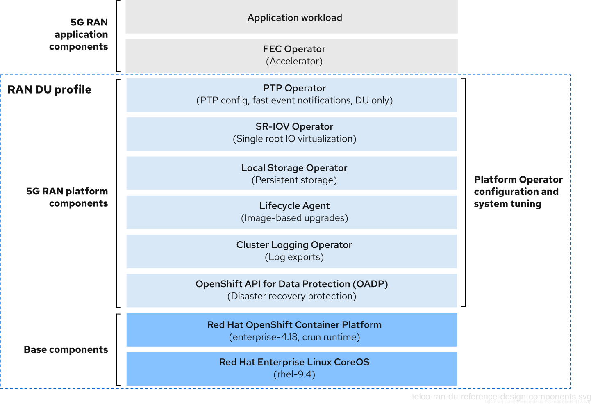

# vDU (Virtual Distributed Unit) Profile Testing

This repository provides a complete deployment and configuration setup for a virtualized Distributed Unit (vDU) profile testing environment using OpenShift Container Platform. The setup creates a hyperconverged 3-node master cluster (no workers) optimized for telco/edge computing workloads with real-time performance, SR-IOV networking, and virtualization capabilities.

## Requirements

- KCLI client
- Working pull secret
- KVM RT `subscription-manager repos --enable=rhel-9-for-x86_64-nfv-rpms` (`kernel-rt-kvm`)

## Deployment Overview

This deployment consists of three main phases:

### Phase 1: Infrastructure Setup (kcli_plan.yml)

- **3-node OpenShift cluster** with masters acting as workers
- **12 CPUs and ~40GB RAM** per node for optimal performance
- **100GB storage** per node plus additional 100GB disk
- **OpenShift 4.19** (stable channel)

### Phase 2: vDU Profile Configuration (addons/)

The addons are applied in a specific order to configure the telco/edge computing stack:

1. **Container & Kubelet Configuration** - Base container optimizations
2. **PTP (Precision Time Protocol)** - Network time synchronization
3. **SR-IOV** - Single Root I/O Virtualization for network performance
4. **Accelerated Container Startup** - Faster container initialization
5. **Performance Profile** - Real-time kernel and CPU isolation
6. **KDump** - Kernel crash dump configuration
7. **Node Remediation & Health Check** - Automated node management
8. **Local Storage Operator & Discovery** - Storage management foundation
9. **ODF (OpenShift Data Foundation)** - Distributed storage cluster
10. **OpenShift Virtualization** - VM workload support
11. **Grafana & Monitoring** - Observability stack
12. **CRI-O Optimizations** - Container runtime tuning
13. **Chrony** - Network time synchronization
14. **Resource Footprint Reduction** - Optimize for edge deployment
15. **VM Project & Templates** - Virtual machine management
    - ABB SSC600 appliance template
    - Fedora VM template
    - VM instances from templates

### Phase 3: Network Configuration

- **DHCP Network** - Bridge network with DHCP IP assignment
- **L2 Private Network** - Private layer-2 network for VM isolation

## Step-by-Step Deployment

### 1. Prepare the Environment

Store your OpenShift pull secret in `openshift_pull.json` alongside the `kcli_plan.yml` file.

### 2. Deploy the OpenShift Cluster

```bash
kcli create plan
```

Monitor the installation progress:

```bash
export KUBECONFIG=/root/.kcli/clusters/hub/auth/kubeconfig
watch -d 'oc get clusterversion; oc get nodes -o wide; oc get mcp; oc get co'
```

### 3. Apply vDU Configuration

The vDU profile configuration is applied using Kustomize, which ensures all components are deployed in the correct order:

```bash
oc apply -k addons/
```

**Important Notes:**

- The performance profile configures **real-time kernel** (`kernel-rt`), which triggers node reboots
- **Machine Configuration Pools** (MCPs) will update sequentially
- Complete deployment takes 30-45 minutes due to node reboots and operator installations

### 4. Verify Real-Time Kernel Installation

After all MCPs show `UPDATED=True`, verify the real-time kernel is active:

```bash
oc get nodes -o wide
```

Expected output showing `+rt` kernel:

```text
NAME                            STATUS   ROLES                         AGE     VERSION   INTERNAL-IP       EXTERNAL-IP   OS-IMAGE                                                KERNEL-VERSION                    CONTAINER-RUNTIME
hub-ctlplane-0.karmalabs.corp   Ready    control-plane,master,worker   5d22h   v1.31.8   192.168.122.8     <none>        Red Hat Enterprise Linux CoreOS 418.94.202505062142-0   5.14.0-427.68.1.el9_4.x86_64+rt   cri-o://1.31.8-3.rhaos4.18.gitf0f6e96.el9
hub-ctlplane-1.karmalabs.corp   Ready    control-plane,master,worker   5d22h   v1.31.8   192.168.122.228   <none>        Red Hat Enterprise Linux CoreOS 418.94.202505062142-0   5.14.0-427.68.1.el9_4.x86_64+rt   cri-o://1.31.8-3.rhaos4.18.gitf0f6e96.el9
hub-ctlplane-2.karmalabs.corp   Ready    control-plane,master,worker   5d22h   v1.31.8   192.168.122.97    <none>        Red Hat Enterprise Linux CoreOS 418.94.202505062142-0   5.14.0-427.68.1.el9_4.x86_64+rt   cri-o://1.31.8-3.rhaos4.18.gitf0f6e96.el9
```

## Post-Deployment Configuration

### Cluster Upgrades

If upgrading the cluster (via `oc adm upgrade`), acknowledge API changes:

```bash
oc -n openshift-config patch cm admin-acks --patch '{"data":{"ack-4.18-kube-1.32-api-removals-in-4.19":"true"}}' --type=merge
```

### Storage Configuration (ODF/OCS)

Label nodes for OpenShift Data Foundation storage:

```bash
oc label node hub-ctlplane-{0,1,2}.karmalabs.corp cluster.ocs.openshift.io/openshift-storage=""
```

Set Ceph RBD as the default storage class:

```bash
oc patch storageclass ocs-storagecluster-ceph-rbd -p '{"metadata": {"annotations":{"storageclass.kubernetes.io/is-default-class":"true"}}}'
```

### Enable label in the nodes for vm workload loading

```bash
oc label node hub-ctlplane-{0,1,2}.karmalabs.corp cpumanager=true
```

## Virtual Machine Management

### Available VM Templates

The deployment includes pre-configured VM templates:

- **ABB SSC600 Appliance** - Industrial automation appliance template
- **Fedora VM** - General-purpose Linux VM template

### Managing VM Network Interfaces

Add additional network interfaces to VMs:

```bash
virtctl addinterface <vm-name> --network-name=dhcp-network --name=eth1
```

### Network Configurations

- **dhcp-network**: Bridge network with DHCP IP assignment via `br-ex`
- **vm-private-l2-net**: Private L2 network with whereabouts IPAM for static IP assignment (192.168.2.0/24)

#### Static IP Assignment

VMs can be assigned static IP addresses on the `vm-private-l2-net` network by adding the `k8s.v1.cni.cncf.io/networks` annotation to the VM template metadata. The network uses whereabouts IPAM which provides cluster-wide IP address management and honors specific IP requests when they fall within the configured range (192.168.2.10 - 192.168.2.200).

For example:

```yaml
annotations:
  k8s.v1.cni.cncf.io/networks: '[{"name":"vm-private-l2-net","namespace":"vm-workloads","ips":["192.168.2.10/24"]}]'
```

Current static IP assignments:

- ABB SSC600 VM: `192.168.2.10/24`
- Fedora VM: `192.168.2.11/24`

To assign a different static IP to your VM:

1. Choose an available IP in the range `192.168.2.10` - `192.168.2.200`
2. Update the `ips` field in the annotation with your desired IP/CIDR
3. Configure the same IP statically inside the VM's network configuration

Whereabouts IPAM will allocate the specific IP you request (if available) rather than assigning a random IP from the pool. Unlike host-local, whereabouts provides cluster-wide IP coordination, preventing IP conflicts across multiple nodes.

##### Advantages of Whereabouts over Host-Local:

- **Cluster-wide coordination**: Prevents IP conflicts across multiple nodes
- **Persistent IP tracking**: Uses Kubernetes custom resources to track IP allocations
- **Better for multi-node clusters**: Ideal when VMs can be scheduled on different nodes
- **Static IP support**: Still honors specific IP requests via annotations
- **Automatic cleanup**: Releases IPs when pods/VMs are deleted

#### VM-to-VM Communication

VMs connected to the `vm-private-l2-net` network can communicate with each other directly using their assigned IP addresses within the `192.168.2.0/24` subnet. The bridge CNI plugin creates a virtual bridge (`kv-l2-br0`) that connects all VMs on the same network, enabling:

- **Direct VM-to-VM communication** within the subnet (e.g., 192.168.2.10 ↔ 192.168.2.11)
- **Layer 2 connectivity** for broadcast and multicast traffic
- **Gateway access** via 192.168.2.1 for external connectivity

Example connectivity test from inside a VM:

```bash
# Ping another VM in the same network
ping 192.168.2.11

# Check network interface
ip addr show net1
```

## Architecture Reference

According to the [Red Hat telco RAN DU reference design documentation](https://docs.redhat.com/en/documentation/openshift_container_platform/4.18/html-single/scalability_and_performance/index#telco-ran-du-reference-design-components_telco-ran-du), this deployment implements the complete vDU profile:



## Troubleshooting

### Check Deployment Status

```bash
# Monitor all operators
oc get co

# Check Machine Configuration Pools
oc get mcp

# Verify performance profile
oc get performanceprofile

# Check virtualization installation
oc get hyperconverged -n openshift-cnv
```

### Common Issues

- **Node reboots**: Expected during performance profile application
- **Storage not ready**: Ensure all nodes are labeled for OCS
- **VM creation fails**: Verify storage class and network configurations are applied
